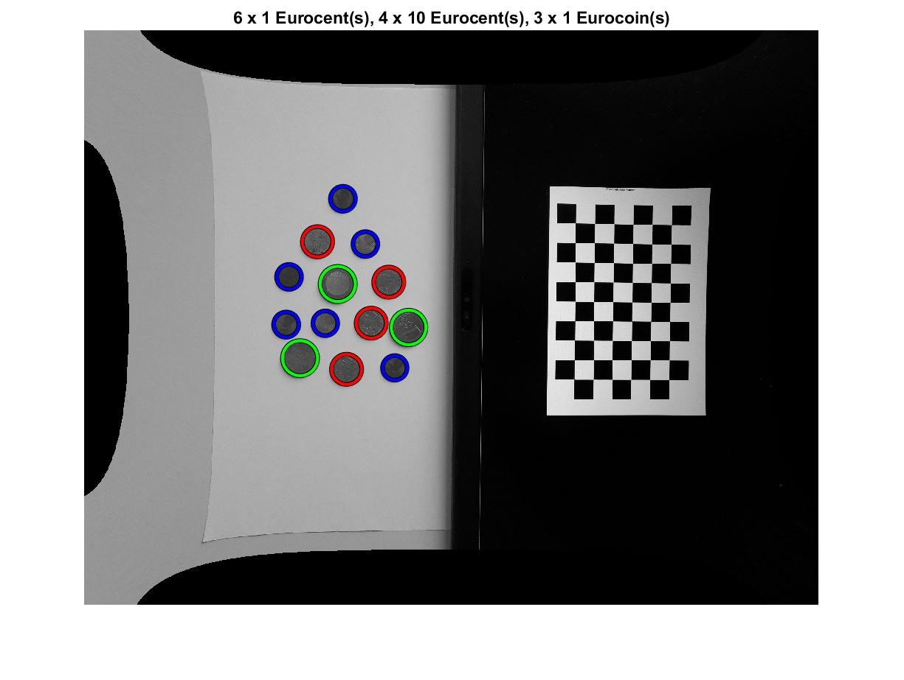
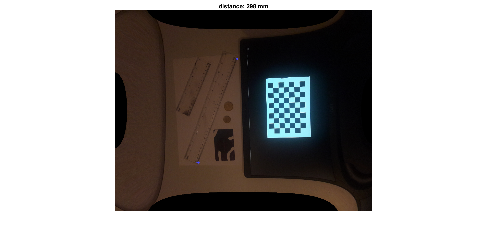

# CameraCalibration
The camera/smartphone is turned into a ruler and coin classifier. The aim is to measure objects in world units (Millimeters). Using MATLAB we will process an image to extract distances between two points in world units. The intrinsic camera parameters and distortion are determined via Matlab Computer Vision Toolbox. The extrinsic parameters of the camera depend on the current camera position and orientation. That is why the checkerboard pattern is part of the image.
 
 
Coin Classifier:
 

Ruler
 

Pictures used for Camera Calibration:
 

